<h1 align="center">Zero-Trust-Overview</h1>

<h2 align="center">zero trust overview, what is zero trust, tong quan zero trust</h2>

  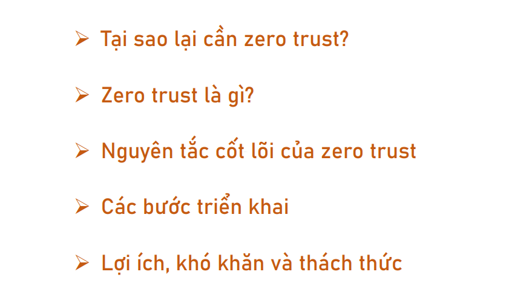

### Mô hình bảo mật Zero Trust

Mô hình bảo mật Zero Trust là một trong những xu hướng bảo mật hiện đại đang được hầu hết các doanh nghiệp lớn trên toàn cầu áp dụng rộng rãi như Cisco, Microsoft, Fortinet, Palo Alto... Hầu như tất cả các tổ chức bảo mật lớn trên thế giới đều đã triển khai.

Hẳn không khó để các bạn thấy được rằng các cuộc tấn công mạng ngày càng trở nên tinh vi và phức tạp hơn. Trong bối cảnh đó, các tổ chức cũng đã nhận ra rằng việc dựa vào ranh giới an toàn mạng nội bộ không còn đủ để bảo vệ dữ liệu và hệ thống của họ như trước nữa.

Do đó, việc phải xem xét lại cách tiếp cận bảo mật mạng là điều cấp thiết, và điều này dẫn tới sự ra đời của khái niệm **Zero Trust**.

Theo mình tìm hiểu, hiện tại các tổ chức và doanh nghiệp bảo mật lớn vẫn đang tiếp tục nghiên cứu và hoàn thiện mô hình này. Khả năng cao là trong những năm tới, mô hình **Zero Trust** sẽ còn phát triển mạnh, và chúng ta – những người làm trong lĩnh vực bảo mật – sẽ phải làm việc nhiều với nó. Đó cũng là lý do mình chọn chủ đề này để tìm hiểu trong bài hôm nay.

  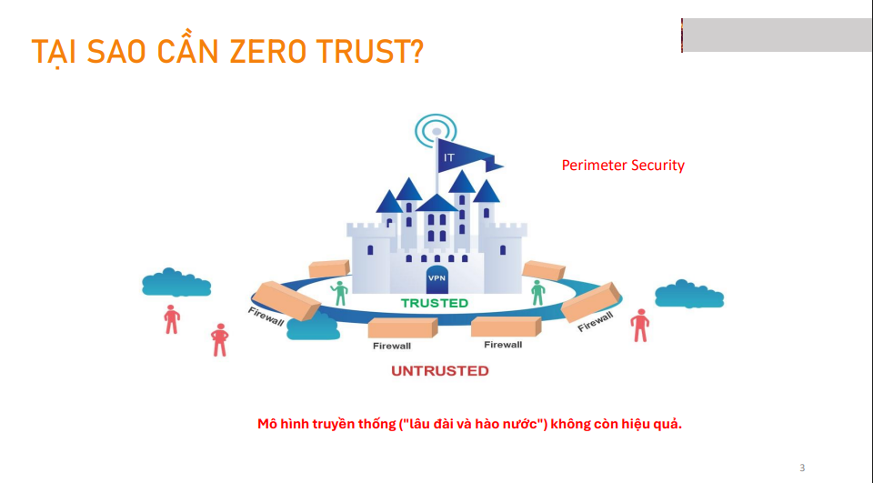

  
### Tại sao lại cần Zero Trust

Trước khi công nghệ điện toán đám mây, làm việc từ xa và thiết bị cá nhân trở nên phổ biến, hầu hết các tổ chức đều vận hành trên một nền tảng bảo mật tập trung, 
Mô hình an ninh truyền thống nơi mà mọi thành phần bên trong mạng được mặc định là 'đáng tin cậy', và các mối đe dọa chủ yếu đến từ bên ngoài. Việc xây dựng các lớp phòng thủ tập trung tại biên mạng, như firewall hay hệ thống phát hiện xâm nhập (IDS), từng là tiêu chuẩn trong nhiều năm.

Tuy nhiên, mô hình này đang dần bộc lộ nhiều hạn chế trước sự thay đổi nhanh chóng của môi trường CNTT hiện đại

Theo mô hình bảo mật truyền thống, thường được gọi là "castle-and-moat" (lâu đài và hào nước), dựa trên ý tưởng rằng biên giới mạng là rào cản chính, và mọi thứ bên trong được coi là an toàn. Tuy nhiên, vấn đề của mô hình này là nếu một hacker xâm nhập được vào bên trong, họ có thể truy cập mọi thứ.

Ngược lại, Zero Trust không tin tưởng bất kỳ ai hoặc thiết bị nào, dù ở bên trong hay bên ngoài mạng. Mỗi yêu cầu truy cập đều phải được xác minh, giúp giảm thiểu rủi ro từ các cuộc tấn công nội bộ, như được ghi nhận.

  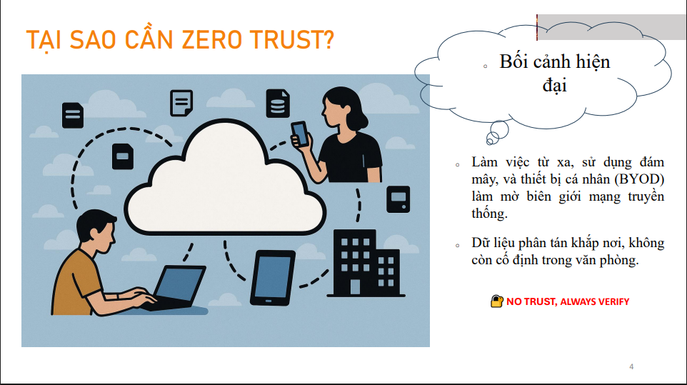

Trong thời đại ngày nay, nhân viên có thể ở bất kỳ đâu, từ quán cà phê đến phòng khách tại nhà. Họ sử dụng đám mây để lưu trữ tài liệu, truy cập ứng dụng, và thậm chí mang theo thiết bị cá nhân – laptop, điện thoại – để làm việc. Điều này làm mờ đi ranh giới mạng truyền thống mà chúng ta từng dựa vào, như tường lửa hay văn phòng cố định.
  
Điều đáng lo hơn là dữ liệu của chúng ta giờ đây không còn nằm yên trong máy chủ tại công ty. Nó phân tán khắp nơi – trên các dịch vụ lưu trữ như Google Drive, Microsoft Azure, hay thậm chí trong email cá nhân. Khi biên giới mạng không còn rõ ràng và dữ liệu trôi nổi như vậy, liệu chúng ta có thể tiếp tục tin tưởng rằng những gì bên trong hệ thống là an toàn? Câu trả lời là: Không.

Một vấn đề lớn hơn của mô hình cũ là lateral movement, tức là di chuyển ngang. Một khi mà kẻ tấn công nó lọt được vào bên trong rồi ấy thì chúng có thể tự do đi lại từ phòng này sang phòng khác để truy cập các tài nguyên quan trọng khác một cách khá là dễ dàng.

Đây chính là lý do Zero Trust ra đời – để bảo vệ từng mảnh dữ liệu, từng thiết bị, bất kể chúng ở đâu
– với triết lý cốt lõi là: 

  
"***No trust, Always Verify -Không tin tưởng, luôn xác minh***"

  

  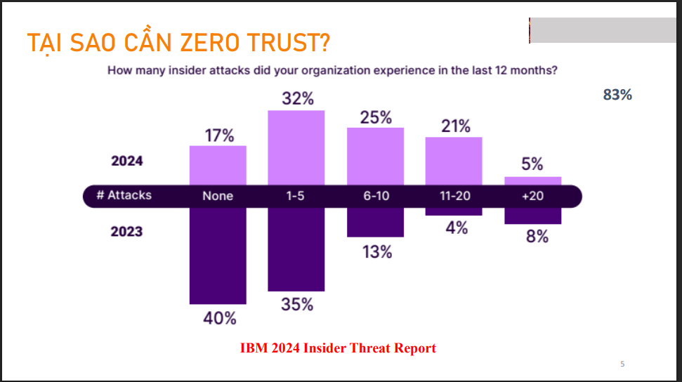

  
Theo IBM 2024 Insider Threat Report  83% tổ chức báo cáo ít nhất một vụ tấn công nội bộ trong năm 2024. Ngoài ra, số lượng tổ chức trải qua 11-20 vụ tấn công nội bộ tăng từ 4% năm 2023 lên 21% năm 2024. 

** Báo cáo này dựa trên khảo sát 413 chuyên gia IT và an ninh mạng, cung cấp cái nhìn sâu sắc về xu hướng rủi ro nội bộ.
  
Khảo sát phản ánh sự gia tăng đáng lo ngại của các mối đe dọa từ nội bộ, đòi hỏi tổ chức phải có chiến lược bảo vệ phù hợp, không chỉ từ bên ngoài mà còn từ bên trong chính hệ thống của mình.

  

  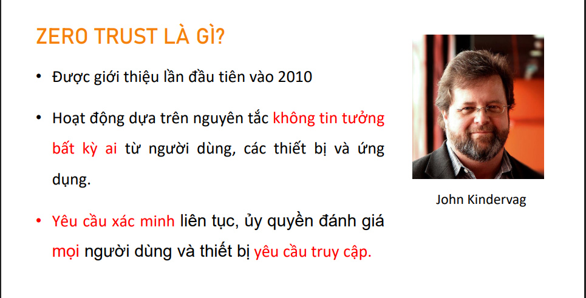

### Vậy thì zero trust là gì?
  
Zero Trust nó không chỉ là công nghệ, nó là một sự thay đổi trong cách suy nghĩ về bảo mật. Mình chuyển từ việc cố xây một cái pháo đài bất khả xâm phạm sang một mô hình linh hoạt hơn, nơi mà mọi truy cập đều phải được kiểm tra liên tục, không có tin tưởng mặc định.

Mục tiêu thực tế của nó là chỉ cho phép đúng người dùng có đúng quyền truy cập vào đúng dữ liệu vì đúng lý do đó.

Cái câu khẩu hiệu của nó là không bao giờ tin tưởng, luôn xác minh, never trust, always verify. Bất kể người dùng đang ở đâu, dù là trong văn phòng, ngồi quán cà phê, hay ở nhà đều bị đối xử như nhau. Đều bị coi là có khả năng gây hại cho đến khi chứng minh được là mình an toàn. Phải liên tục chứng minh danh tính và quyền truy cập mình.
 

Điều này có nghĩa là sau khi một người dùng hoặc thiết bị đã được xác thực (chứng minh được họ là ai), hệ thống sẽ thực hiện ủy quyền để xác định những tài nguyên cụ thể nào mà họ được phép truy cập và họ có thể làm gì với những tài nguyên đó

  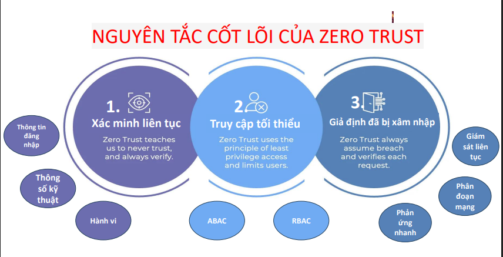

Để đạt được những điều này , Zerotrust đặt ra một vài khái niệm trọng tâm
Nguyên tắc cốt lõi: 
Xác minh liên tục: Không tin tưởng bất kỳ ai, luôn kiểm tra danh tính, thiết bị,vị trí , và hành vi người dùng. 
  
Ví dụ:

Mỗi khi một thiết bị hoặc người dùng yêu cầu truy cập vào tài nguyên, hệ thống sẽ khởi động quá trình kiểm tra theo từng bước sau:

ví dụ như là thông tin đăng nhập, xác thực đa yếu tố, rồi kiểm tra cả tình trạng sức khỏe của cái thiết bị đang dùng để truy cập nữa. Hệ điều hành có mới nhất không? Có cài phần mình diệt virus không? Nó có đang chạy bình thường không?
rồi vị trí địa lý, thời gian truy cập, hành vi người dùng có bất thường không?

Và quan trọng nhất là việc kiểm tra này nó diễn ra liên tục cho mỗi một yêu cầu truy cập tài nguyên chứ không phải chỉ một lần lúc đầu.

Mỗi lần anh muốn mở một file, truy cập một ứng dụng, hệ thống lại đánh giá lại xem anh có còn đủ an toàn và có đúng quyền không.

Nếu hệ thống phát hiện dấu hiệu bất thường (ví dụ như đăng nhập từ vị trí khác thường, thiết bị chưa từng đăng nhập trước đó), nó sẽ yêu cầu người dùng xác thực lại qua các phương pháp như MFA.

Quyền truy cập tối thiểu:  Nguyên tắc này yêu cầu là chỉ cấp cho người dùng này, ứng dụng này hay là thiết bị đúng những cái quyền hạn tối thiểu nhất mà họ cần để hoàn thành công việc của mình thôi

Hệ thống quản lý truy cập dựa trên vai trò (RBAC):
Ví dụ như bạn chỉ cần đọc tài liệu thì bạn chỉ được phép đọc mà không có bất kỳ quyền chỉnh sữa hay xóa gì. Hoặc là một ví dụ rất phổ biến là trong việc  cấp quyền cho các thành viên, vì người quản trị cảm thấy phức tạp khi phải cấp từng quyền cho từng người thì cấp thẳng quyền admin luôn cho nhanh. Đây là một hành động cực kỳ nguy hiểm gấy mất an toàn thông tin cho tổ chức.

Hệ thống truy cập dựa trên chính sách (ABAC):
Định nghĩa: Quyết định cấp quyền dựa trên các thuộc tính (attribute) của người dùng, thiết bị, và ngữ cảnh truy cập (ví dụ: thời gian, vị trí, thiết bị, mức độ rủi ro).

Ví dụ: Một chính sách có thể quy định rằng chỉ cho phép truy cập vào dữ liệu nhạy cảm từ các thiết bị đã đăng ký và được kiểm tra bảo mật, trong giờ hành chính làm việc từ 8h-16h.

Giả định đã bị xâm nhập: Thiết kế hệ thống như thể đã có mối đe dọa, giám sát liên tục và giới hạn phạm vi ảnh hưởng. Hệ thống luôn trong trạng thái cảnh giác cao độ, giả định rằng có thể đã bị xâm nhập, từ đó giám sát và phản ứng liên tục.

Quy trình thực hiện:
Điều này nó buộc chúng ta phải làm hai việc chính. Một là phải phân đoạn segmentation mạng và người dùng thành các khu vực nhỏ độc lập với nhau.
Để nếu một khu vực bị tấn công ấy thì thiệt hại nó sẽ được giới hạn trong khu vực đó thôi. không lan ra toàn bộ hệ thống.
Cách tiếp cận này đảm bảo rằng ngay là khi một phân đoạn bị vi phạm, khả năng di chuyển ngang qua mạng của kẻ tấn công sẽ bị hạn chế đi rất nhiều

  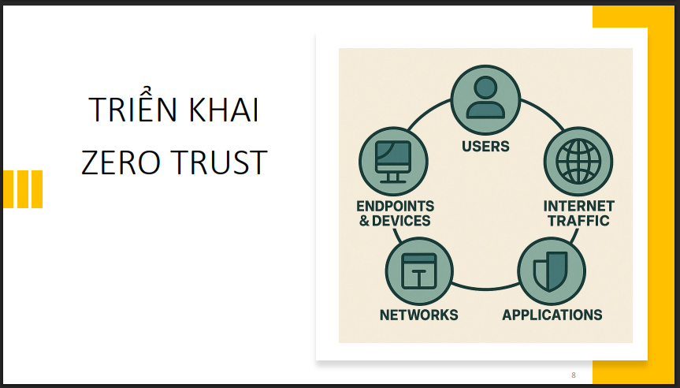

  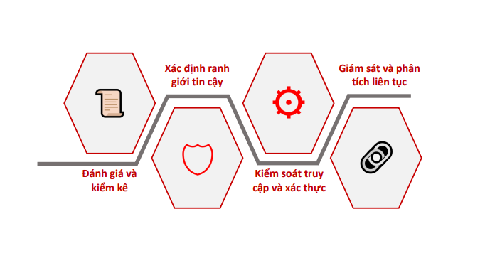

  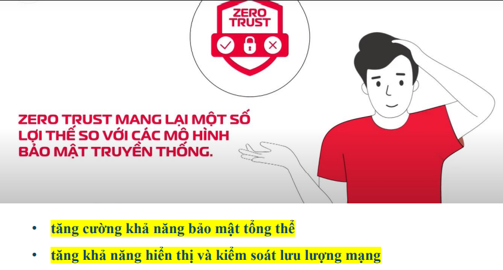

  

  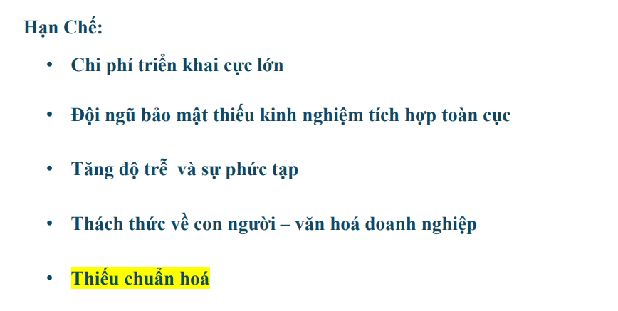

  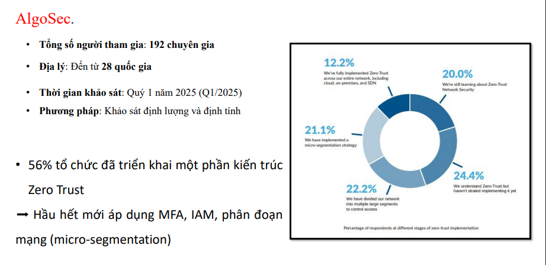

  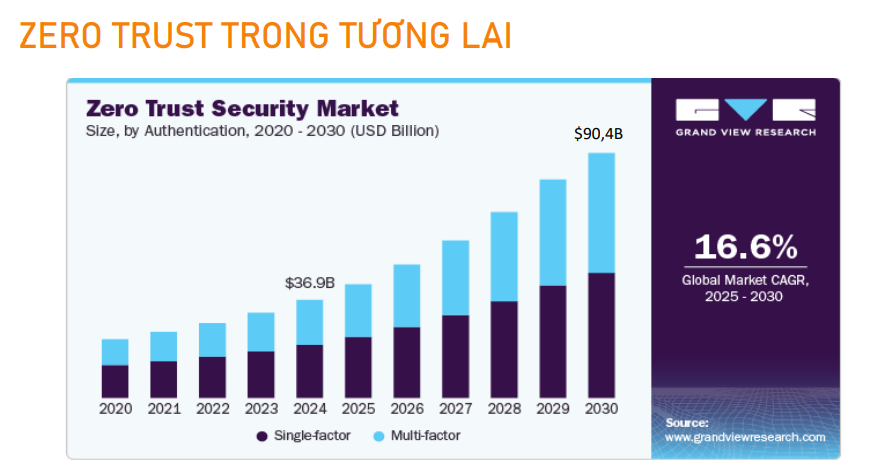

